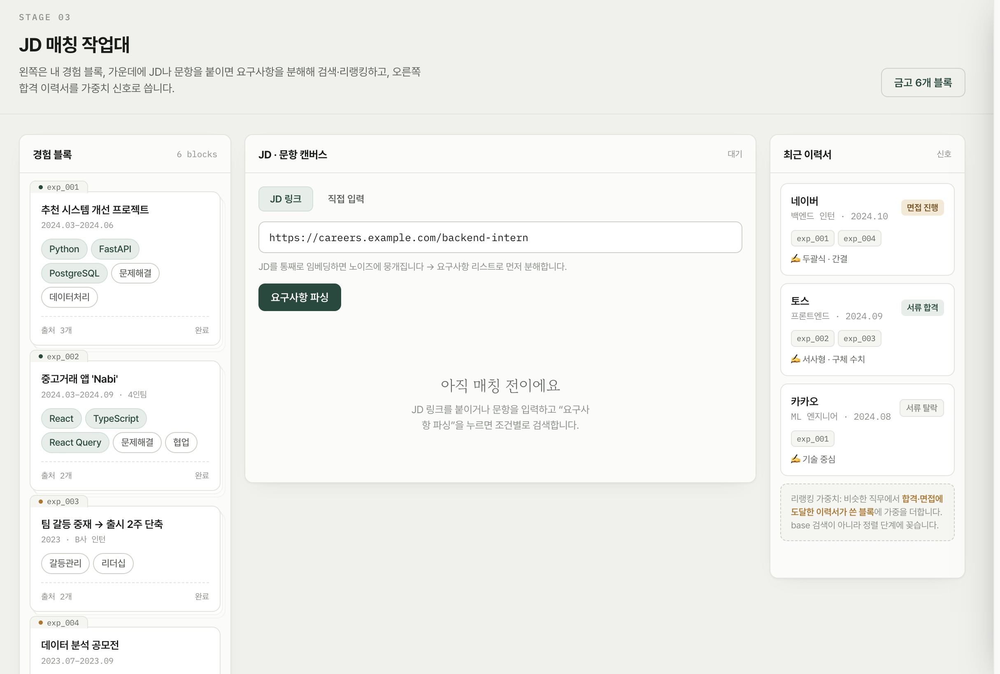
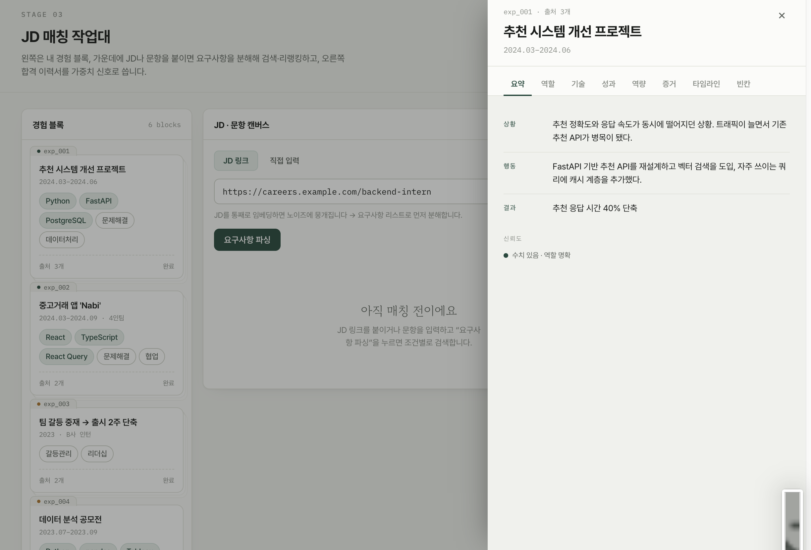

# KHU:DArchive

> KHUDA 9기 · 정기학술제

## 소개

KHU:DArchive는 사용자의 자기소개서, 이력서, 포트폴리오 메모 등 흩어진 커리어 기록을 경험 단위로 정리하고, JD/문항별로 적합한 경험을 추천한 뒤 자기소개서 초안까지 작성해주는 경험 기반 자기소개서 작성 보조 프로젝트입니다.

## 팀원

| 이름 | 역할 |
| :---: | :--- |
| 김연길 | [역할] |
| 김정원 | [역할] |
| 서지은 | [역할] |
| 신진수 | [역할] |

## 대표 사진





## 기술 스택

- `Backend: Python, FastAPI, SQLAlchemy, Alembic, Pydantic`
- `Database: PostgreSQL, pgvector`
- `AI: LangChain, OpenAI LLM, OpenAI Embeddings`
- `Infrastructure: Docker Compose`  
- `Test: pytest`

## MVP 범위

1. 과거 기록 입력 및 원문 보존
2. 경험 단위 구조화와 출처 추적
3. 경험 Vault 검색 및 JD/문항 기반 경험 추천
4. 부족한 정보 보완 질문 생성 및 답변 반영
5. 추천 경험과 원문 근거를 활용한 자기소개서 초안 생성

## 구조

```text
.
├── apps/
│   ├── backend/          # FastAPI backend
│   └── frontend/         # frontend workspace
├── packages/
│   └── api-client/       # generated API client workspace
├── infra/
│   └── postgres/         # local PostgreSQL/pgvector setup
├── docs/                 # project documentation
├── scripts/              # utility scripts
├── docker-compose.yml
└── README.md
```

## 문서

- [프로젝트 개요](docs/project.md)
- [사용자 시나리오](docs/scenarios.md)
- [시스템 구성](docs/architecture.md)
- [API 문서](docs/api.md)
- [로컬 개발 및 실행](docs/development.md)
